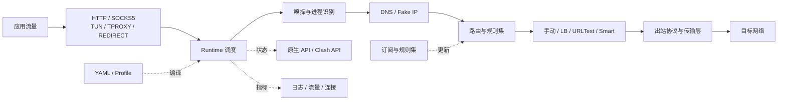

<p align="center">
  
</p>

<h1 align="center">WutherCore</h1>

<p align="center">
  一个可组合的跨平台 Rust 代理内核
</p>

<p align="center">
  <a href="https://github.com/MiChongs/WutherCore/actions/workflows/ci.yml"></a>
  <a href="https://www.rust-lang.org/"></a>
  <a href="LICENSE"></a>
</p>

<p align="center">
  <a href="#快速开始">快速开始</a> ·
  <a href="docs/FEATURES.md">功能矩阵</a> ·
  <a href="docs/CONFIGURATION.md">配置指南</a> ·
  <a href="docs/ARCHITECTURE.md">架构</a> ·
  <a href="docs/API.md">API</a> ·
  <a href="CONTRIBUTING.md">参与贡献</a>
</p>

WutherCore 读取 YAML 配置，负责订阅更新、节点选择、规则分流、DNS 解析、透明代理和运行状态管理。仓库提供代理内核与命令行工具，不包含桌面或移动端 GUI。

> [!IMPORTANT]
> 项目仍在 1.0 之前。当前版本适合能够阅读日志、维护配置并自行验证服务端兼容性的用户；配置结构与 API 仍可能调整。

## 为什么做这个内核

| 配置清楚 | 模块可换 | 平台能力集中 | 运行过程可观察 |
| --- | --- | --- | --- |
| YAML 配置可以先 `check`、再 `explain`，启动前就能看到错误和最终运行计划。 | 入站、DNS、规则、选择器、出站协议、流量接管和 API 分成独立 workspace crate。 | 同一套运行时覆盖普通代理、TUN、TPROXY、REDIRECT 与 Android VpnService 接入。 | 原生 `/v1` API 与 Clash 兼容接口提供状态、流量、连接、节点和策略组信息。 |

## 关键能力

| 领域 | 已实现 |
| --- | --- |
| 入站 | 同端口 HTTP / SOCKS5，访问认证，局域网共享 |
| 节点 | 本地节点、订阅拉取、过滤、重命名、去重与磁盘缓存 |
| 选择 | 手动、负载均衡、URLTest、Smart 学习、固定与回避 |
| 路由 | 域名、IP、端口、进程、嗅探结果、内联规则与外部规则集 |
| DNS | 多上游、缓存、IPv6 策略、Fake IP、Hosts、Fallback 与独立 UDP/TCP 监听 |
| 流量接管 | TUN、TPROXY、REDIRECT、自动路由、排除项和失败回滚 |
| 管理 | 原生 HTTP API、Clash 兼容 API、连接管理、测速、流量与日志 |
| 持久化 | 节点评分、Smart 学习、手动选择、Pin 与运行状态 |
| 工具 | 配置校验与解释、Mihomo 配置迁移、订阅刷新、规则集转换、Store 管理 |

完整的能力边界、协议实现与成熟度说明见 [功能矩阵](docs/FEATURES.md)。

## 平台与协议

### 平台

| 平台 | 普通代理 | 透明代理 |
| --- | :---: | --- |
| Windows | HTTP / SOCKS5 | TUN |
| Linux | HTTP / SOCKS5 | TUN / TPROXY / REDIRECT |
| macOS | HTTP / SOCKS5 | TUN |
| Android | 宿主应用接入 | VpnService FD / root |

透明代理会修改系统网络状态，通常需要管理员或 root 权限。先验证普通代理，再启用 `capture`；平台准备和排错见 [配置指南](docs/CONFIGURATION.md) 与 [排错手册](docs/TROUBLESHOOTING.md)。

### 出站协议

| 基础 | Shadowsocks 系列 | TLS / UUID 系列 | QUIC / 隧道 |
| --- | --- | --- | --- |
| Direct、Block、HTTP、SOCKS5、DNS Hijack | Shadowsocks、Shadowsocks 2022、SSR、Snell | Trojan、VLESS、VMess、AnyTLS | Hysteria、Hysteria 2、TUIC、WireGuard、SSH、Mieru、Sudoku、TrustTunnel |

不同协议的 UDP、复用和传输层组合并不完全相同。功能矩阵只表示代码路径已经实现，不代替与具体服务端版本的兼容性测试。

## 快速开始

需要 Rust 1.85 或更高版本；`rust-toolchain.toml` 默认使用 stable 工具链。

```bash
git clone https://github.com/MiChongs/WutherCore.git
cd WutherCore
cargo build --release -p wuther-core
```

复制一份示例配置并替换其中的订阅地址或节点：

```bash
cp examples/desktop.yaml config.yaml
```

Windows PowerShell 可以使用：

```powershell
Copy-Item examples\desktop.yaml config.yaml
```

先检查配置，再启动：

```bash
./target/release/wuther-core check config.yaml
./target/release/wuther-core run -c config.yaml
```

Windows 可执行文件位于 `target\release\wuther-core.exe`。也可以不单独构建：

```bash
cargo run --release -p wuther-core -- check config.yaml
cargo run --release -p wuther-core -- run -c config.yaml
```

## 最小配置

```yaml
version: 1
profile: desktop
name: my-profile

listen:
  local: 7890
  panel: 9090
  share: false

feeds:
  airport: "https://example.com/your-subscription"

groups:
  main:
    choose: smart
    use: [airport]

route:
  preset: cn_smart
  final: main

resolver:
  mode: smart
```

用 `explain` 查看 profile 默认值补全后的 `RuntimePlan`：

```bash
wuther-core explain config.yaml
```

可直接修改的示例：

| 文件 | 场景 |
| --- | --- |
| [`examples/desktop.yaml`](examples/desktop.yaml) | 桌面端最小配置 |
| [`examples/router.yaml`](examples/router.yaml) | 路由器与透明代理 |
| [`examples/android.yaml`](examples/android.yaml) | Android VpnService |
| [`examples/with_feed.yaml`](examples/with_feed.yaml) | 订阅过滤和重命名 |
| [`examples/manual_only.yaml`](examples/manual_only.yaml) | 只使用手动节点 |
| [`examples/daily.yaml`](examples/daily.yaml) | 自定义分组与路由 |

## 一条连接如何通过内核



更完整的模块边界、启动过程和数据流见 [架构说明](docs/ARCHITECTURE.md)。

## 命令行

```text
wuther-core run -c <file>                        启动内核
wuther-core check <file>                         校验配置
wuther-core explain <file>                       输出编译后的 RuntimePlan
wuther-core migrate mihomo <input> -o <output>  迁移 Mihomo 配置
wuther-core feeds list <file>                    列出订阅
wuther-core feeds refresh <file>                 立即刷新订阅
wuther-core ruleset list <file>                  列出外部规则集
wuther-core ruleset refresh <file>               立即刷新外部规则集
wuther-core ruleset convert <in> <out>           转换规则集格式
wuther-core store info                           查看持久化存储
wuther-core store reset                          清空学习数据
```

每个命令都支持 `--help`。规则集转换支持 YAML、文本、sing-box JSON 和 WutherCore RRS，输入格式通常可以自动识别。

## 文档

| 文档 | 内容 |
| --- | --- |
| [文档中心](docs/README.md) | 从使用、开发或集成角度选择入口 |
| [功能矩阵](docs/FEATURES.md) | 能力、协议、平台支持和限制 |
| [配置指南](docs/CONFIGURATION.md) | 配置结构、Profile、验证与迁移 |
| [架构说明](docs/ARCHITECTURE.md) | workspace 边界、连接路径和扩展点 |
| [管理 API](docs/API.md) | 鉴权、原生 `/v1` 端点和兼容接口 |
| [排错手册](docs/TROUBLESHOOTING.md) | 权限、TUN、DNS、订阅与日志排查 |
| [路线图](ROADMAP.md) | 当前重点与 1.0 前的完成标准 |
| [内核设计文档](RP内核设计文档.md) | 更详细的设计背景和实现说明 |
| [构建性能](docs/BUILD-PERF.md) | Cargo 构建与编译性能配置 |
| [构建脚本](scripts/README.md) | 多平台构建脚本和产物 |

## 开发与协作

```bash
cargo fmt --all --check
cargo check --workspace --all-targets
cargo test --workspace
cargo doc --workspace --no-deps
python scripts/check-repository.py
```

提交代码前请阅读 [CONTRIBUTING.md](CONTRIBUTING.md)。Bug 和功能建议使用 [Issue 表单](https://github.com/MiChongs/WutherCore/issues/new/choose)，配置讨论与一般问题放在 [Discussions](https://github.com/MiChongs/WutherCore/discussions)。

安全问题不要公开提交 Issue，请按照 [SECURITY.md](SECURITY.md) 私下报告。维护方式、PR 门禁和管理员紧急合并路径见 [GOVERNANCE.md](GOVERNANCE.md)。

## License

WutherCore 使用 [MIT License](LICENSE) 开源。
