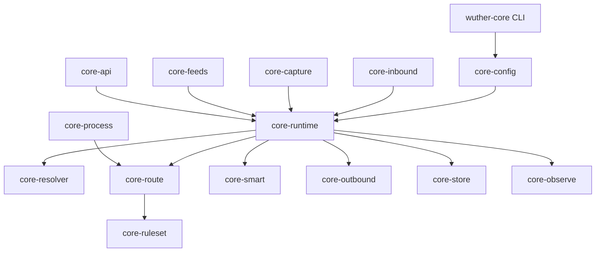
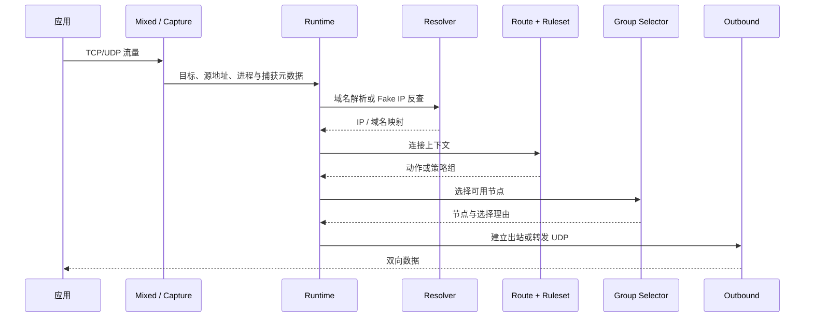

# 架构说明

WutherCore 是一个 Cargo workspace。配置、入站、解析、路由、选择、出站、流量接管、API 与持久化拆成独立 crate，由 `wuther-core` 负责装配。

## 总览

依赖方向不是严格分层模型：`core-runtime` 负责把多个能力组合成一条连接路径，`core-capture` 和 `core-outbound` 也会调用解析、规则与观测能力。新增跨模块调用前，应先判断它属于配置编译、运行时编排还是协议细节。

## 一条 TCP/UDP 流量的路径

运行时同时把连接、流量、节点选择与错误交给 `core-observe`，并通过 `core-api` 暴露给管理端。

## Workspace 边界

| Crate | 主要职责 | 不应承担 |
| --- | --- | --- |
| `wuther-core` | CLI、进程启动、组件装配 | 协议细节和路由算法 |
| `core-config` | YAML 模型、Profile、默认值、迁移、`RuntimePlan` | 网络 I/O |
| `core-inbound` | HTTP/SOCKS5 监听与入站会话 | 节点选择 |
| `core-capture` | TUN、TPROXY、REDIRECT、系统路由与平台适配 | 协议握手 |
| `core-runtime` | 生命周期、调度、健康检查和组件编排 | 平台命令拼装 |
| `core-resolver` | DNS、缓存、Fake IP、上游策略 | 通用路由决策 |
| `core-route` | 规则执行、嗅探结果和匹配上下文 | 订阅下载 |
| `core-ruleset` | 外部规则集解析、匹配和格式转换 | 连接调度 |
| `core-smart` | 节点评分、学习、Pin/Avoid 和选择解释 | 节点协议 |
| `core-outbound` | 出站协议、传输层和 UDP 能力 | 顶层配置加载 |
| `core-feeds` | 订阅拉取、缓存、解析和更新 | 出站握手 |
| `core-api` | 原生 API、兼容 API、鉴权与限流 | 系统权限管理 |
| `core-observe` | 日志、流量、连接表和 watchdog | 路由配置 |
| `core-store` | redb 持久化 | 业务策略 |
| `core-process` | 进程识别 | 连接转发 |
| `core-mesh` | Mesh 相关抽象 | 顶层 CLI |

## 启动过程

1. CLI 解析子命令和配置路径。
2. `core-config` 加载 YAML，应用 Profile 默认值并编译为 `RuntimePlan`。
3. Store、订阅与规则集管理器准备运行状态。
4. Runtime 创建解析器、路由器、策略组和出站注册表。
5. Mixed 入站、管理 API 与配置指定的 Capture 方式启动。
6. 退出或启动失败时，已安装的系统路由和捕获规则按 guard/事务路径回滚。

`check` 只执行配置加载与编译；`explain` 输出最终 `RuntimePlan`，适合确认默认值和路由展开结果。

## 主要扩展点

### 新增出站协议

- 在 `core-outbound` 实现统一 Outbound 接口；
- 在节点解析模型中加入协议与字段映射；
- 在 registry 中完成构造与错误处理；
- 覆盖握手、异常输入、关闭、UDP 能力和敏感日志测试；
- 更新 [功能矩阵](FEATURES.md) 与示例。

### 新增路由条件

- 先在配置模型中定义输入形式；
- 编译到稳定的运行时匹配结构；
- 明确多个字段之间的 AND/OR 语义；
- 覆盖字符串简写、对象形式、错误提示和外部规则集交互。

### 新增平台捕获方式

- 权限探测与安装必须分开；
- 系统修改需要幂等清理和部分失败回滚；
- 说明与其他 VPN、防火墙和路由软件的冲突；
- 在无法覆盖的平台上提供可读诊断，而不是静默降级。

## 安全边界

- API 密钥、订阅、节点密码、UUID、PSK 和私钥不得写入普通日志。
- 管理 API 暴露到非本机地址时必须配置 `ui.secret` 和 CORS allowlist。
- 系统路由与防火墙修改应保留恢复路径。
- 协议规定的固定向量、测试凭据和真实硬编码凭据必须在安全扫描中区分处理。
- 外部输入包括 YAML、订阅、规则集、DNS 响应和管理 API；解析失败应返回边界清楚的错误。

